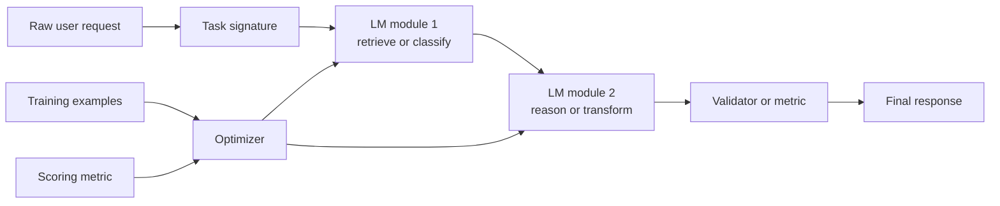

Large language model applications usually begin with a deceptively simple pattern: write a prompt, send it to a model, inspect the answer, and tweak the wording until the result looks acceptable. This works for demos, but it starts to break as soon as the task becomes multi-step, user-facing, or difficult to evaluate consistently.

The deeper issue is that a prompt is not a system design. A real application usually needs several things at once: decomposition of the task, predictable structure in the outputs, ways to inspect where failures occur, and some systematic way to improve quality over time. Treating the entire workflow as a single blob of text hides all of these concerns.

DSPy is useful because it encourages a different mental model: instead of thinking in terms of one giant prompt, think in terms of a **program made of language-model components**. Each component has a job, each interface is explicit, and the pipeline can be evaluated as a system rather than as a vague conversation.



## Why Structure Matters

Most brittle LLM applications fail for one of a few recurring reasons:

- the task is underspecified
- the model is being asked to do too many things in one step
- outputs are hard to validate automatically
- changes to one part of the prompt silently break another part

A structured pipeline reduces this fragility. If a task can be separated into retrieval, reasoning, classification, validation, and response formatting, then each stage can be designed, measured, and improved independently. This makes the overall system easier to debug and much easier to evolve.

## From Prompting to Programs

The main conceptual shift is to stop treating prompts as isolated artifacts and start treating them as executable building blocks. In practice, that means:

- defining the task clearly through input-output signatures
- breaking the application into smaller LM modules
- composing those modules into a reusable workflow
- attaching evaluation metrics to the workflow instead of judging outputs informally

This shift matters because many LLM improvements come not from clever wording, but from better task design. A cleaner decomposition often beats a more elaborate prompt.

One of the most useful ideas in DSPy is the **signature**. A signature is not just a template string. It is a compact way of declaring what the system should consume and what it should return. That sounds small, but it changes the workflow a lot. Once inputs and outputs are explicit, modules can be composed more cleanly and failures become much easier to inspect.

For example, instead of thinking:

> "write one long prompt that summarizes, classifies, and explains"

you start thinking:

- one module extracts the relevant evidence
- another module reasons over that evidence
- a final module formats the result for the user

That decomposition is valuable even before any optimizer is involved, because it turns the application into something you can actually test.

## The Three Pieces That Matter Most

### 1. Signatures

Signatures define the task contract. They say what fields go in, what fields come out, and what kind of transformation the module is expected to perform. This gives you a layer of abstraction above prompt wording.

### 2. Modules

Modules are the units of behavior. In practice, they let you swap execution strategies without rewriting the task itself. A signature might stay the same while the module changes from a direct prediction call to chain-of-thought reasoning or to tool use.

### 3. Optimizers

Optimizers are where DSPy becomes especially interesting. Instead of manually rewriting prompts after every failure case, you give the system examples and a scoring function. The optimizer then searches for better instructions, demonstrations, or configurations that improve the metric you care about.

## What DSPy Changes

DSPy provides abstractions for describing what a module should do and then optimizing how that module is realized. Rather than hand-crafting one static prompt forever, you can think of the prompt as a parameterized part of the system that can be improved against a metric.

That is important for two reasons.

First, it makes **iteration reproducible**. If performance improves, you can point to the module, the metric, and the optimization setup rather than relying on intuition and memory.

Second, it makes **evaluation less subjective**. Once a task has a structure and a target, optimization stops being "I think this answer sounds better" and becomes closer to normal engineering: define the interface, define the objective, and measure progress.

## Where Fine-Tuning Fits

One of the biggest misconceptions in beginner LLM work is that poor performance immediately implies the need for fine-tuning. In many cases, the real problem is weaker system structure:

- the model is being asked to solve several subproblems at once
- the output format is ambiguous
- no intermediate validation step exists
- the evaluation method is too informal to reveal what is actually wrong

Fine-tuning can help, but it should often come after stronger task design. A good structured pipeline helps answer whether the limitation is in the prompt, the decomposition, the retrieval strategy, or the model weights themselves.

## A Practical Workflow

A useful workflow for building structured LM systems looks something like this:

1. Define the task in terms of inputs and outputs.
2. Break the task into modules where failures can be localized.
3. Create a simple baseline system first.
4. Add evaluation that captures actual task quality.
5. Improve the weakest modules before reaching for heavier interventions.

This approach is especially important for small teams and student builders. If compute is limited, then better structure is often the cheapest and most scalable source of quality improvement.

In a small real-world system, the workflow often looks something like this:

```python
import dspy

class AnswerQuestion(dspy.Signature):
    question = dspy.InputField()
    context = dspy.InputField()
    answer = dspy.OutputField()

class QAPipeline(dspy.Module):
    def __init__(self):
        self.answer = dspy.ChainOfThought(AnswerQuestion)

    def forward(self, question, context):
        return self.answer(question=question, context=context)
```

The important part is not the syntax. The important part is the way of thinking. The task is explicit. The module is explicit. The output is explicit. Once that exists, you can score the system, compare alternatives, and improve it without turning every iteration into prompt archaeology.

## Where This Helps Most

DSPy tends to be most useful in applications where:

- the workflow has multiple steps
- outputs need to follow a consistent schema
- quality has to be measured repeatedly
- prompt edits are becoming hard to track
- multiple models or tools may need to interact

That is why it fits naturally with retrieval pipelines, extraction systems, structured QA, and agent-style applications. It is less about adding complexity for its own sake, and more about making inevitable complexity visible and manageable.

## Takeaway

The core idea is straightforward: robust LLM applications are not just prompts, they are programs. Once you start thinking in terms of modules, interfaces, evaluation, and optimization, the system becomes easier to reason about and easier to improve. DSPy is valuable because it gives that mindset a concrete framework.
