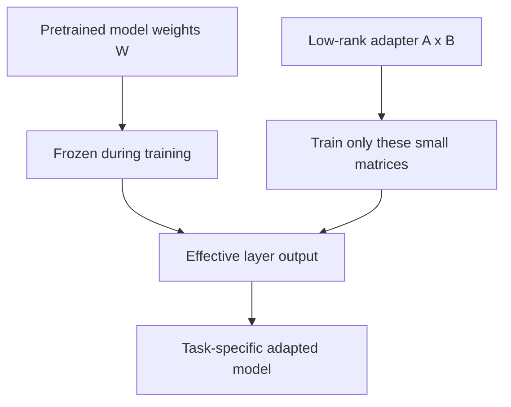

Fine-tuning sounds intimidating because the phrase often gets associated with huge clusters, expensive experiments, and giant models being retrained from scratch. In practice, many useful adaptations do not need that level of machinery. What they need is a careful task definition, a good dataset, and an adaptation method that changes the model efficiently instead of rewriting everything.

LoRA, or Low-Rank Adaptation, is important because it makes that possible. Rather than updating the entire weight matrix of a model, LoRA learns a much smaller low-rank update that is inserted into selected layers. The frozen base model stays mostly intact, while the trainable adapter captures the task-specific behavior you care about.



## Why LoRA Matters

The appeal of LoRA comes from a simple observation: for many downstream tasks, you do not need to relearn the entire model. You only need to nudge it in a more useful direction.

That gives several practical advantages:

- much lower memory cost during training
- fewer trainable parameters
- faster experimentation
- easier storage and sharing of task-specific adapters

For student teams or small research groups, this changes the economics of adaptation. Suddenly, fine-tuning becomes something you can iterate on rather than something you have to bet everything on.

The original LoRA framing is powerful precisely because it is so modest. It assumes that the useful update you want to make to a giant model often lives in a much smaller subspace than the full parameter space. If that assumption is good enough, then you get most of the benefit of adaptation without paying the full price of retraining everything.

## When Prompting Is Not Enough

Prompting is often the right first step, but it has limits. If a task requires stable style, consistent formatting, narrow domain behavior, or repeated specialized responses, then prompting alone may become fragile or overly verbose.

LoRA is particularly useful when:

- the model understands the task broadly but performs it inconsistently
- you want tighter control over response style or task behavior
- the domain has regular patterns that prompting alone does not capture well
- repeated prompting overhead becomes cumbersome

The key is not to fine-tune by default. The key is to recognize when the limitation is really in the model behavior rather than in prompt design or system structure.

There is also a more subtle reason to like LoRA: it changes the **operational shape** of experimentation. A full fine-tuning run feels expensive, heavy, and hard to repeat. A LoRA run feels more like a normal ML experiment: train an adapter, compare it to a baseline, inspect the results, and iterate quickly.

## How the Workflow Should Be Thought About

A disciplined adaptation workflow usually has five parts:

1. define the task precisely
2. build a strong prompting baseline
3. prepare a clean training set that reflects the behavior you want
4. fine-tune with conservative settings first
5. evaluate against real failure modes, not just best-case examples

This matters because small mistakes in data curation often dominate the final result. If the dataset is noisy, inconsistent, or poorly aligned with the target behavior, LoRA will faithfully learn those problems as well.

## The Parameters That Quietly Matter

The basic idea behind LoRA is simple, but a few knobs matter a lot in practice:

- **rank (`r`)** controls how much capacity the adapter has
- **alpha** scales the impact of the adapter update
- **dropout** can help stabilize or regularize the learned update
- **target modules** determine where in the network adaptation is inserted

Lower ranks are cheaper and often surprisingly strong, but they can underfit harder tasks. Higher ranks give the adapter more expressive power, but they also increase memory use and can make overfitting easier. In practice, LoRA works best when treated as a tuning problem rather than a one-shot recipe.

## A More Concrete Mental Model

One useful way to think about LoRA is:

- the base model already knows a lot
- your task does not require rewriting all of that knowledge
- it only requires a structured correction in a few useful directions

That correction is what the low-rank update is learning.

In code, the workflow often looks lightweight compared to full-model training:

```python
from peft import LoraConfig, get_peft_model

config = LoraConfig(
    r=16,
    lora_alpha=32,
    lora_dropout=0.05,
    target_modules=["q_proj", "v_proj"]
)

model = get_peft_model(base_model, config)
```

Again, the point is not the exact library call. The point is that the adaptation target is now compact enough that fine-tuning becomes feasible on hardware and timelines that would otherwise rule it out.

## The Most Important Practical Questions

In real projects, the hard part is usually not the LoRA implementation itself. The hard part is answering questions like:

- what examples actually represent the behavior I want?
- how much variation should the training set include?
- how do I know whether the model learned the task rather than memorized style?
- how do I compare an adapted model against a strong prompt baseline fairly?

These questions are what make evaluation central. A fine-tuned model that looks impressive on three hand-picked prompts may still be worse than a simpler prompted baseline when tested systematically.

This is also where many low-quality LoRA tutorials go wrong. They show the happy path, but skip the hard part:

- what was the baseline?
- what exact behavior improved?
- what broke after adaptation?
- how stable is the result across prompts and examples?

Without those checks, an adapter can look impressive while mostly learning superficial formatting habits.

## Deployment Trade-Offs

After adaptation, deployment becomes the next constraint. A more specialized model is only useful if it still fits the latency, memory, and maintenance envelope of the application. In practice, that means balancing:

- quality improvements from adaptation
- inference cost
- model size
- operational simplicity

For many real applications, the best result is not the most heavily adapted model, but the one that gives enough specialization while remaining easy to serve and update.

An underrated benefit of LoRA is that adapters can often be merged or swapped cleanly. That makes it easier to maintain multiple task-specific variants without duplicating entire models. For organizations or student labs running several experiments in parallel, that is often as valuable as the raw training efficiency.

## Takeaway

LoRA makes fine-tuning feel less like a giant engineering commitment and more like a practical tool in the model-builder's toolbox. The important lesson is not just that LoRA is efficient, but that useful adaptation comes from pairing efficient methods with careful task framing, clean data, and honest evaluation.
