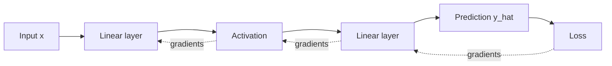

Deep learning feels magical only until you see the small set of ideas underneath it. At its core, a neural network is just a parameterized function that takes an input, transforms it through layers, compares the prediction against a target, and adjusts itself by following gradients that reduce error.

That sentence sounds simple, but it hides the two things beginners usually struggle with most: **representation** and **learning**. Representation asks what the network can express; learning asks how the network discovers useful parameters in the first place.



## From Linear Models to Networks

A good starting point is the linear model. A linear model takes an input vector, applies weights, adds a bias, and produces a score. This is powerful enough for simple decision boundaries, but it quickly fails when the relationship between input and output is nonlinear.

That is why hidden layers matter. Once nonlinear activation functions are inserted between linear transformations, the network stops being just one linear map and becomes a composition of many functions. This allows it to represent much richer patterns:

- curved decision boundaries
- hierarchical feature extraction
- interactions between input dimensions
- high-level abstractions built from low-level signals

The practical lesson is that depth is useful not because "more layers are always better," but because composition lets the model build increasingly expressive representations.

One useful intuition is that each hidden layer is building a new representation space. The early layers respond to simpler patterns, while later layers can combine those patterns into more task-specific abstractions. In image models, this might look like edges becoming textures and then object parts. In text models, it might look like token-level patterns becoming phrase-level or sentence-level structure.

## What a Neuron Is Really Doing

A neuron is often introduced visually, but the essential idea is functional. It computes a weighted combination of its inputs and then passes the result through a nonlinearity. The nonlinearity is crucial. Without it, stacking layers would still collapse into one giant linear transformation.

This is why activation functions matter. ReLU, tanh, GELU, and similar choices are not cosmetic details. They affect:

- how gradients flow
- how easily networks optimize
- how sparse or dense representations become
- how stable training is across depth

Once you understand this, the basic architecture of a feedforward network feels much less mysterious: each layer transforms the representation into something more useful for the final prediction task.

If you had to compress the entire idea into one sentence, it would be this: a neural network is a stack of learned feature transformations. The weights decide which signals matter, and the activation function decides how those signals are reshaped before they move to the next layer.

## How Learning Actually Happens

The forward pass is the easy part. The harder question is how the model improves. That is where the loss function and backpropagation come in.

The loss function defines what "bad prediction" means. Backpropagation then answers a specific question: how much did each parameter contribute to that error? Using the chain rule, gradients are propagated backward from the output to earlier layers, assigning credit and blame throughout the network.

This is the key idea: backpropagation is not a separate kind of intelligence. It is an efficient bookkeeping mechanism for computing how to change millions of parameters in the right direction.

Gradient descent then uses that information to update weights. Over many iterations, the model gradually shifts from random behavior to task-specific competence.

The forward pass and backward pass are tightly coupled:

- the **forward pass** computes predictions and stores intermediate values
- the **backward pass** reuses those values to compute derivatives efficiently
- the **optimizer step** updates parameters using those derivatives

This is one reason training consumes more memory than inference. During training, the model has to remember enough of the computation graph to send gradient signals backward later.

Even a toy implementation makes the workflow easier to see:

```python
import torch
import torch.nn as nn

model = nn.Sequential(
    nn.Linear(2, 16),
    nn.ReLU(),
    nn.Linear(16, 1)
)

x = torch.randn(32, 2)
y = torch.randn(32, 1)

criterion = nn.MSELoss()
optimizer = torch.optim.Adam(model.parameters(), lr=1e-3)

pred = model(x)          # forward pass
loss = criterion(pred, y)
loss.backward()          # backward pass
optimizer.step()         # parameter update
optimizer.zero_grad()
```

This is small, but it already contains the full training loop used by much larger models: compute, compare, differentiate, update, repeat.

## Why Training Often Fails

Understanding the math is only half the story. In practice, most frustration comes from the gap between a correct-looking implementation and a model that actually learns.

Training can fail for many reasons:

- the learning rate is too high and optimization diverges
- the learning rate is too low and progress becomes negligible
- initialization causes gradients to vanish or explode
- the model is too small to fit the task
- the model is too large and memorizes noise
- the data pipeline is inconsistent or poorly normalized

This is why deep learning should be learned as a systems discipline, not just as equations on a whiteboard. A working model depends on architecture, optimization, data quality, batching, initialization, and evaluation all interacting correctly.

Another practical issue is that gradients themselves can become pathological. In deep networks, they may shrink too much as they move backward, making early layers learn extremely slowly, or blow up so much that training becomes unstable. This is part of why initialization schemes, activation choices, normalization layers, and residual connections became so important in modern deep learning.

## Generalization Matters More Than Memorization

A network that performs well on the training set has not necessarily learned useful structure. It may simply have memorized examples. The real goal is generalization: learning patterns that transfer to unseen data.

This is why validation curves matter so much. They help distinguish:

- underfitting, where the model has not learned enough
- healthy learning, where both training and validation improve
- overfitting, where training keeps improving but validation degrades

Once students understand this, deep learning stops being "make the loss go down at any cost" and becomes a more disciplined process of balancing capacity, optimization, and generalization.

This is also where regularization enters the picture. Techniques such as weight decay, dropout, data augmentation, and early stopping all try to make the model learn more robust structure instead of fitting accidental quirks of the training set.

## Why the Fundamentals Scale

The same ideas that explain a small multilayer perceptron also explain much larger systems. Convolutional networks add spatial structure. Recurrent networks add sequence dependence. Transformers change the mechanism of interaction. But the underlying logic remains familiar:

- represent inputs in a learnable way
- define an objective
- compute gradients
- optimize parameters
- evaluate generalization

This continuity is important because it makes advanced architectures easier to approach. Once the core principles are clear, new model families feel like design extensions rather than entirely different worlds.

That continuity is especially important for beginners. It means that understanding multilayer perceptrons is not wasted effort. The details of CNNs, RNNs, and Transformers differ, but the central logic of learning through differentiable computation is the same. The fundamentals transfer.

## Takeaway

The most useful mental model for deep learning is not "magic pattern recognition." It is iterative function learning under optimization. A neural network is a compositional function approximator, and training is the process of reshaping that function through gradients until it captures useful structure in data. With that view, deep learning becomes far less mysterious and much more workable.
